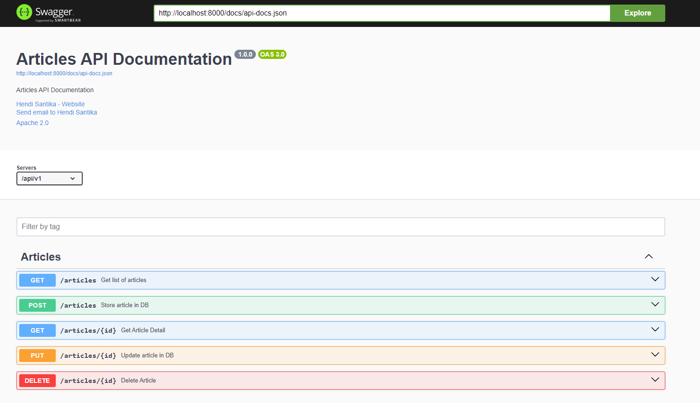

# Laravel Swagger

### Things to do

1. Clone this repository: `git clone https://github.com/hendisantika/laravel-swagger.git`
2. Navigate to the folder: `cd laravel-swagger`
3. Run the command: `composer install`
4. Run the command: `cp .env.example .env`
5. Set your DB credentials
6. Migrate the tables and seeder: `php artisan migrate --seed`
7. Open your favorite browser: http://localhost:8000/swagger-ui

### Image screen shot

Swagger UI

